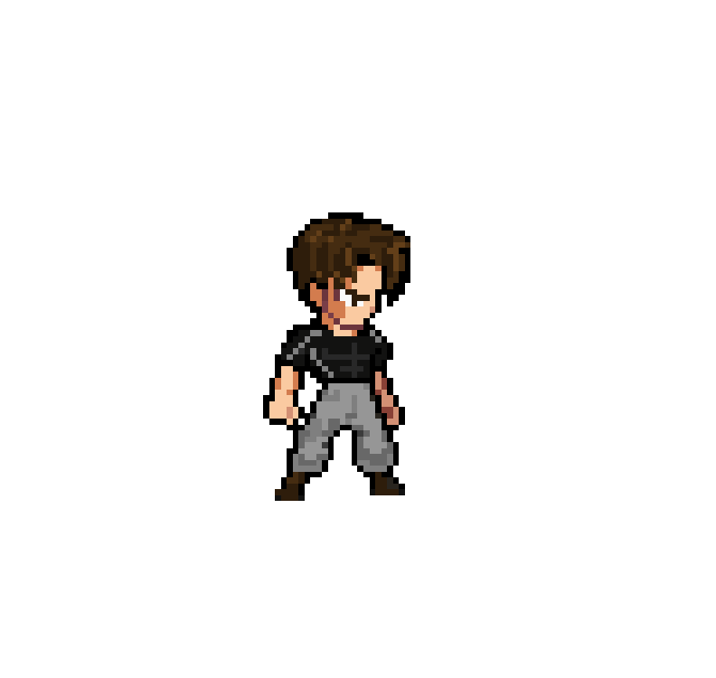

  

    
  

---

## Olá!👋

- 🙋‍♂️ Meu nome é **Carlos Ryan**.  
- 🧑‍💻 Sou estudante de **Análise e Desenvolvimento de Sistemas** no Instituto Federal da Paraíba (**IFPB**), atualmente no **5° período**.  
- 🚀 Apaixonado por tecnologia, gosto de aprender coisas novas e aplicar meus conhecimentos em desafios práticos! 
- 📄 Você pode acessar mais informações sobre minha jornada profissional no meu [currículo](https://drive.google.com/uc?export=download&id=1mNRe_pmpdYRbHbf3yB3smlhQ-Bm3ROvf)

---

### **🌍 Minhas Redes Sociais**

---

### **🛠️ Linguagens e Ferramentas**
<table>
  <tr>
    <td align="center" width="96">
      
       Python
    </td>
    <td align="center" width="96">
      
       Javascript
    </td>
    <td align="center" width="96">
      
       Java
    </td>
    <td align="center" width="96">
      
       Spring
    </td>
    <td align="center" width="96">
      
       Github
    </td>
    <td align="center" width="96">
      
       Rest API
    </td>
    <td align="center" width="96">
      
       Docker
    </td>
  </tr>
  <tr>
    <td align="center" width="96">
      
       Git
    </td>
    <td align="center" width="96">
      
       PostgreSQL
    </td>
    <td align="center" width="96">
      
       React
    </td>
    <td align="center" width="96">
      
       Postman
    </td>
    <td align="center" width="96">
      
       Linux
    </td>
  </tr>
</table>

---

### **🎮 Hobbies**

  - Aprender novas tecnologias e linguagens de programação e criar projetos para colocar o conhecimento em prática.
  - Criar animações em spritesheets e gifs que possam servir para algum game, ex:

  

    
    
  

---

### **📊 Estatísticas do GitHub**

   
  

---

### **Contador de Visitantes**

  
  

